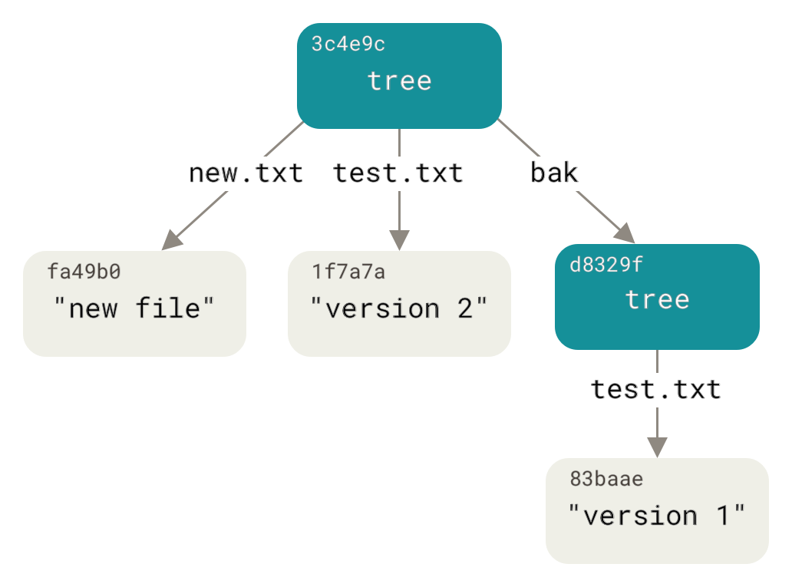
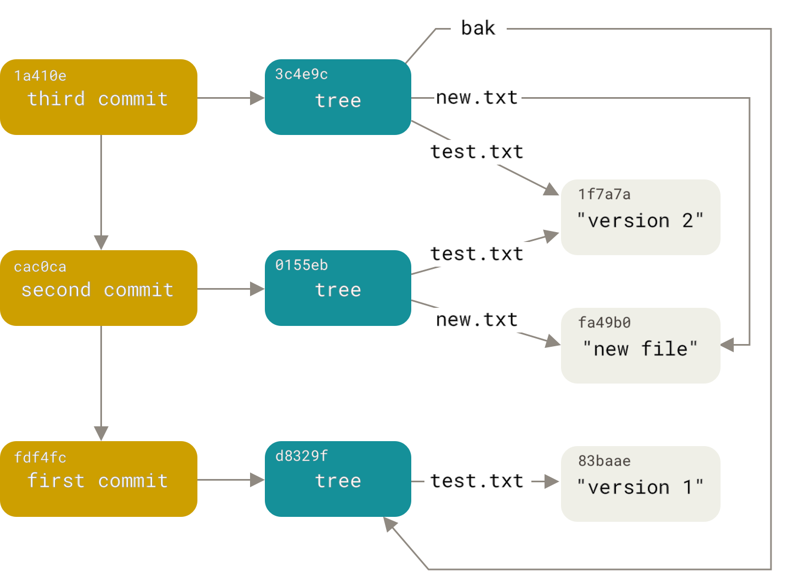
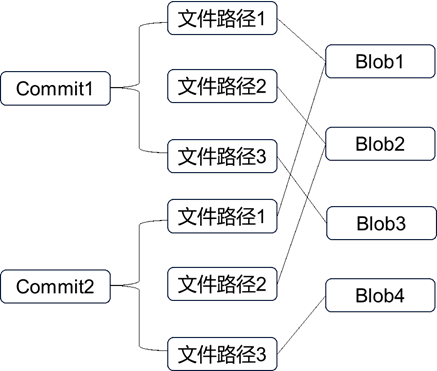
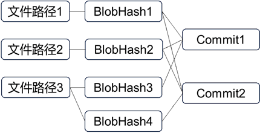
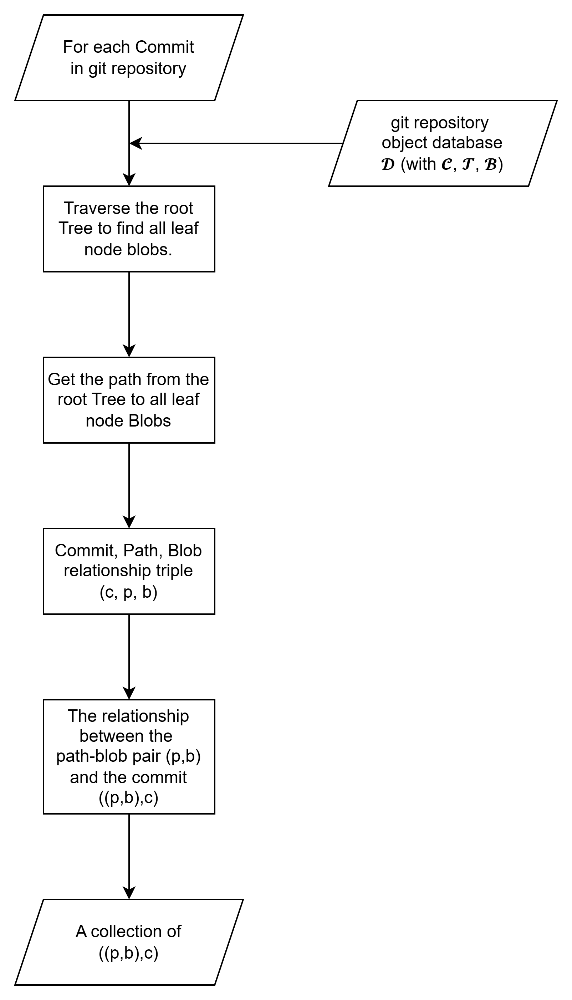
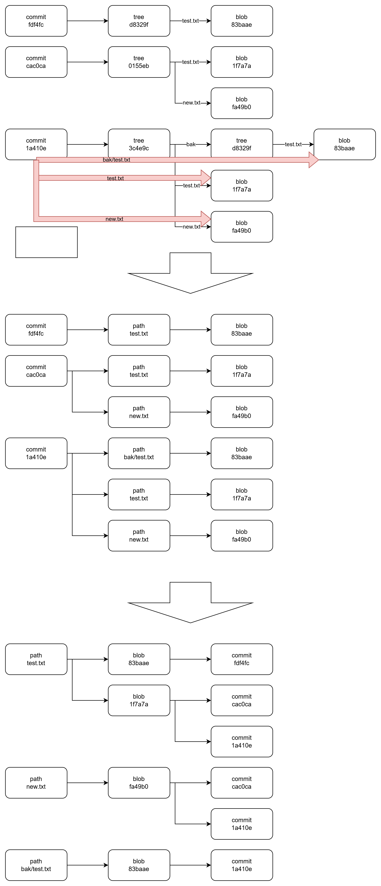
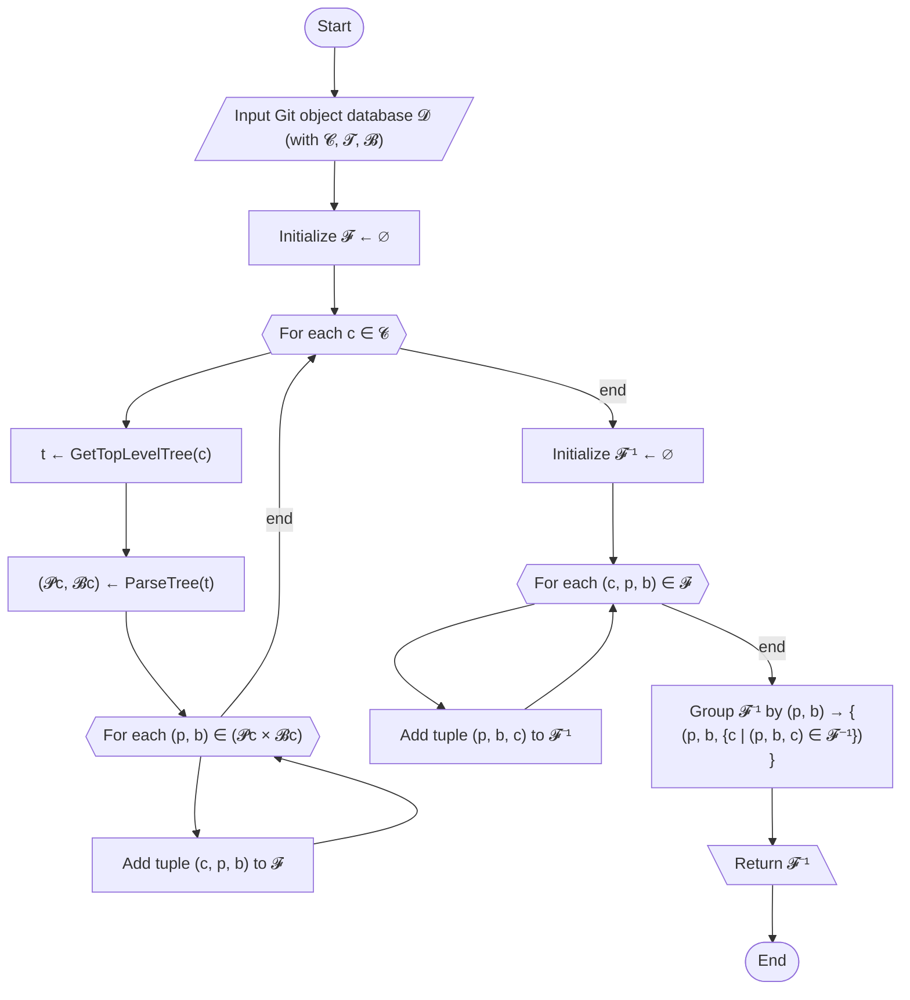
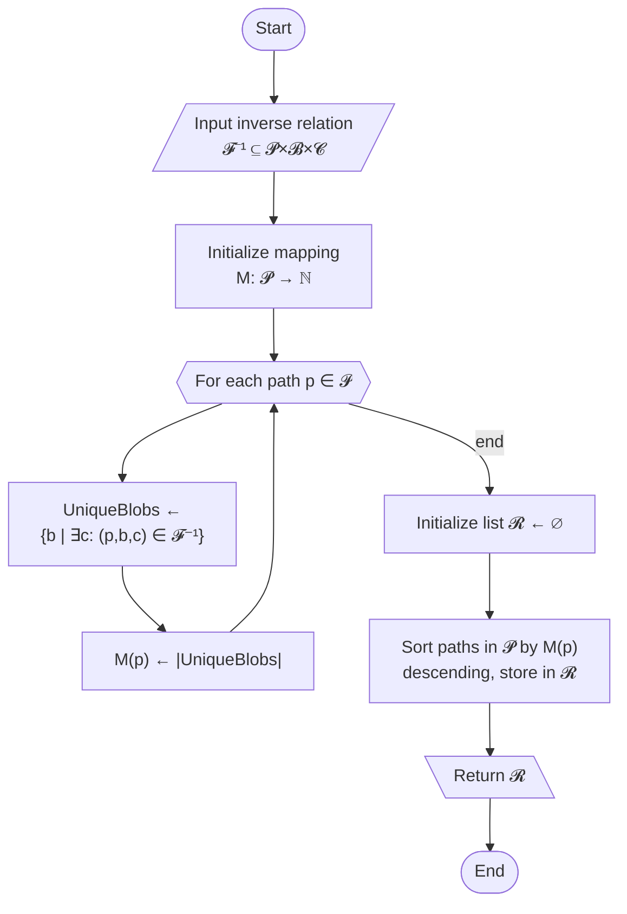
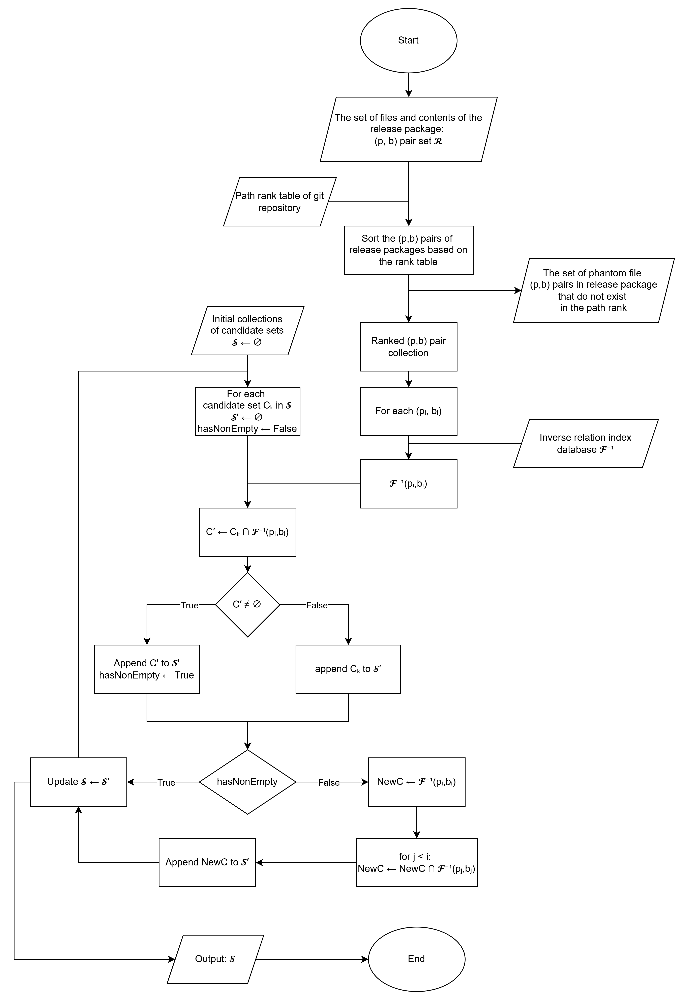

# gvca：在供应链最后一英里差异检测中对发行版源码在git源码仓库中进行commit版本溯源

## Abstract

## Introduction

## Terminology

## Background 

### git仓库对象模型

git仓库是一个内容寻址文件系统，其核心是一个key-value数据库，git仓库不可变的核心历史内容将以“git object”的形式在此数据库中管理。易变的内容（branch、tag、HEAD、remote-tracking等）则以“ref”的形式保存。

有4种git object：blob、tree、commit、tag。所有的git object的key均为在该git object的value前附加一个git object头信息（包含git object类型和git object内容大小）后计算其SHA校验和获得的哈希值。一个git仓库可支持SHA-1或SHA-256校验和计算，但目前主流在线仓库托管平台中只有gitlab实验性支持SHA-256，包括github在内的多数仓库托管平台仅支持SHA-1。

#### blob对象

blob对象保存一个git仓库历史中存在的文件内容。它不包含文件名等文件内容本身以外的信息。git仓库版本历史中多个内容相同的不同路径或名称文件共享同一个blob对象。

#### tree对象

tree对象保存一个git仓库目录下的内容，由多个tree entry组成，每个tree entry引用另一个tree对象/blob对象/其他仓库的commit对象的key及其元信息，以指代一个子目录/文件/submodule。tree entry使用mode码记录它引用的对象的类型，其中blob对象有三种模式，分别指代普通文件（100644）、可执行文件（100755）和符号链接（120000）。



#### commit对象

commit对象保存一个git仓库的一个提交的数据快照与元信息。数据快照是一个tree对象的key，通过遍历该顶层tree对象，得以遍历该提交下的所有文件路径与对应文件内容。元信息包括作者、提交者信息、时间戳，以及可能存在的父提交对象的key。



## Threat Model

### 供应链交付阶段“最后一英里”的恶意代码植入攻击

### 漏洞重放攻击

## Motivation

### 开源生态源码交付物脱离仓库可信锚点带来验证真空

软件供应链攻击日益威胁软件交付的完整性。交付阶段的软件供应链攻击发生在从源码到release包的“最后一英里”，是软件供应链攻击的高发阶段。event-stream攻击[]和XZ后门[]等事件中，release包中出现的在原始代码仓库中不存在的恶意代码成为了供应链攻击核心。

这一现象的发生，与当前软件生态在交付阶段的“验证断裂”有较高关系。尽管针对仓库中的源码，可基于版本控制系统的工具高效地进行来源审查，例如git版本管理系统中的git blame与git diff。但是，如果交付的release包源码无法可靠的证明其在仓库中的具体commit来源，由于丢失了交付物在仓库中的可信锚点，验证链条就在此断裂。此时，交付版本的源码将脱离版本控制系统的追踪，其中引入的恶意修改无法在基于版本控制系统的代码审查中被发现。

现实世界中，这种交付物在仓库中可信锚点丢失的现象广泛存在。在一项社区研究中，Levick[Ryan Levick. Rust: Does the published crate match the upstream source?. Octo.2021.](https://codeandbitters.com/published-crate-analysis/)检查了最受欢迎的500各Crate包，发现有23%的交付源码包未能通过启发式方法获得其在源码仓库中的commit来源。

可重现构建被认为是检测交付阶段从源码到发布包“最后一英里”发生的完整性破坏的理想方案。实践中，可重现构建的实现与证明都较为困难。Benedetti等人[Benedetti G, Solarin O, Miller C, et al. An empirical study on reproducible packaging in open-source ecosystems. In: 2025 IEEE/ACM 47th International Conference on Software Engineering (ICSE). 2025:1052-1063. doi:10.1109/ICSE55347.2025.00136]指出，确定源代码仓库中哪个特定commit版本用于生成release的软件包是一个与可重现构建正交的问题，可重现构建的发展并不能缓解确定release包源码与对应commit版本的困难性。

SLSA/Sigstore/in-toto等业内供应链安全框架倡导在供应链交付阶段增加可验证的签名与provence保证追踪。这些机制能在理论上闭合供应链验证的最后一环——从源码到交付物的可证明链路。但是，这些机制的采用门槛高、普及率极低。它们需要开发者主动使用新工具链，很多小型开源项目、个人维护者、甚至中型企业库都没有时间或能力迁移到这些体系中。多种供应链安全框架并存的现状也导致生态碎片化的问题。

SLSA 被认为是这其中最具生态潜力的供应链安全框架。但是，Tamanna等人[1. Tamanna M, Hamer S, Tran M, Fahl S, Acar Y, Williams L. Analyzing challenges in deployment of the SLSA framework for software supply chain security. Published online 2024. https://arxiv.org/abs/2409.05014
]的研究指出，SLSA的采用并不广泛，从业者普遍遇到provence生成复杂、维护复杂、定义与文档不清晰、可行性有限、相关性不清晰等挑战。

因此，构建一种不依赖开发者主动参与、能独立验证release–commit对齐关系的工具，是弥补当前供应链验证追踪研究的缺口的关键。

## 版本对齐验证困难的现状

版本对齐困难源于源码仓库tag和Release管理的非标准化特性。开源生态中，版本标签完全依赖开发者自觉，缺乏统一规范（如Semantic Versioning）。分发平台（如npm、PyPI）通常仅验证包完整性（如hash或签名），不强制要求Release包与源码版本对齐，导致追溯困难。具体而言，以下场景加剧了版本对齐的复杂性：

- 无版本标签：许多源码仓库不包含tag或Release，将Release包映射到特定commit无从下手。
- tag与分发版本不对应：因手动维护或额外构建步骤，源码tag（如v1.2）与分发包版本（如1.2.3）可能不一致。
- tag命名不规范：tag名称如“release-1”或“beta”不遵循标准，自动化工具难以解析对应版本。
- tag丢失：仓库迁移（如 GitHub到GitLab）或清理可能丢失历史tag，尤其是轻量级tag。

Shobe等人[On mapping releases to commits in open source systems]在针对Google Chrome、GNU gcc 和 Subversion三个开源项目中，依赖手工检查日志的方法识别release版本与commit之间的映射关系，过程手动且繁琐。即使开发一种基于启发式的方法来半自动推断这些映射关系，也需要提供具体的发布命名与分支方案以及来源信息。这样的方案对于大量受以上复杂性因素影响的开源软件包无法适用。

## 绕过版本对齐方案的研究存在问题

Vu等人[Vu DL, Massacci F, Pashchenko I, Plate H, Sabetta A. LastPyMile: identifying the discrepancy between sources and packages. In: Spinellis D, Gousios G, Chechik M, Penta MD, eds. ESEC/FSE ’21: 29th ACM Joint European Software Engineering Conference and Symposium on the Foundations of Software Engineering, Athens, Greece, August 23-28, 2021. ACM; 2021:780-792. doi:10.1145/3468264.3468592]尝试绕过版本对齐，如对源码blob的每行变更构建hash数据库，检查Release包的各文件行是否存在于源码中。然而，Git以文件级blob为单位保存对象，检查行级变更需实时计算tree diff，性能较低（时间复杂度 \( O(n * lines) \)，n 为blob数）。更重要的是，此方案无法检测漏洞重放攻击，历史漏洞的代码行可能存在于源码中，但不应出现在最新包中。

本工作提出了一种高效版本对齐方法，通过预处理构建(p,b)到 commit 集合的逆关系映射和path有序列表，动态筛选Release包的候选commit集合。该方法无需依赖标签，鲁棒处理上述困难场景，通过文件级粒度检测漏洞重放，显著增强供应链完整性。

## Challenge

### 从原始commit版本到release版本的黑盒打包过程导致溯源困难

版本溯源，是对给定的最终产物（release源码包）追溯其源头（仓库中的特定commit）的逆向过程。软件开发者从原始commit版本到release版本的打包过程是一个不透明的黑盒过程，此过程引入的变化使得溯源过程难以匹配：

#### 文件集不一致与文件内容不匹配

黑盒打包过程中，开发者可能在release版本中添加源码仓库中不存在的文件，如特定平台的构建脚本，这些文件无法溯源至任何commit；开发者可能在release版本中删除源码仓库存在的文件，如CI配置文件，这些文件的缺失可能导致在多个候选commit中无法锁定具体的对应commit。

开发者可能在release版本中进行源码仓库中不存在的文件修改，这可能是针对特定平台的补丁，也可能包含恶意注入。这些文件同样无法溯源至任何commit。

#### 版本漂移

release版本源码可能存在并非来自其源头commit，而是来自其他commit的文件。如回滚到旧版本或cherry-pick未来版本的内容。这些commit可能被匹配却可能与源头commit互相冲突，若使用单一候选集进行匹配，可能导致错过真正的源头commit。

### 大规模仓库的计算复杂性

在开源软件平台，一些中大型仓库可能拥有约数十万量级的commit。基于现有工具`git log --raw`启发式的对所有release版本文件进行历史查询，将对git仓库重复进行线性扫描，实时进行大量tree diff计算，产生 $ O(|R| \cdot |C| \cdot \log |F|) $ 线性复杂度的开销，其中：

- $ |R| $ 是release源码包的文件数。
- $ |C| $ 是git仓库commit总数，决定单次文件扫描的迭代次数。
- $ |F| $ 是平均每个commit的文件数。在优化后的tree diff下路径查找开销为$ O(\log F) $。

由于现有`git log`工具不支持多线程，多进程使用将产生大量重复I/O开销。这样的开销对于中大型仓库难以接受。

### git仓库结构的复杂性

多数git仓库的历史是非线性的，这导致当使用`git log`作为溯源工具时，即使已知release文件在git仓库历史中有关的commit修改，确认该文件所存在的commit集合需要进行进一步复杂的图遍历。

在git仓库中可能存在一些悬垂commit。这些悬垂commit无法被常规的rev walk方式检索，却可能暗藏珍贵的信息。悬垂commit其本身是远程不可见的，无法稳定获取。

### 开源软件的开发环境差异

开源软件开发者的开发环境可能导致git源码仓库中的文件与实际开发环境中的文件产生意料之外的差异，进而导致release源码包中的文件与git源码仓库中的文件产生差异。例如，当开发者在NTFS文件系统使用符号链接文件时，如果开发者未能正确配置git软件时，可能导致此符号链接在git仓库中被上传为空文件。

## Methodology

为什么重点关注？

在分析和建模git仓库的对象模型时，我们重点关注commit和文件内容之间的关系。一个关键的观察结果是，排除空目录和子模块，Git 存储库的对象组织可以抽象为从提交集合到文件路径-内容对集合的多值映射。形式化表达为令 $\mathcal{F} \subseteq \mathcal{C} \times \mathcal{P} \times \mathcal{B}$ 表示此关系，其中：

- $\mathcal{C}$ 是提交对象集合，
- $\mathcal{P}$ 是文件路径集合,
- $\mathcal{B}$ 是数据块对象集合（代表文件内容）

每个元组 $(c, p, b) \in \mathcal{F}$ 表明提交 $c \in \mathcal{C}$ 包含路径为 $p \in \mathcal{P}$ 的文件，其内容由数据块 $b \in \mathcal{B}$ 表示。该关系捕获了从提交到多个 $(p, b)$ 对的一对多映射，因为单个提交可能通过其关联的树对象引用多个文件。

对git仓库对象模型的实现，存在一个关键观察：不考虑空目录与submodule时，git仓库的对象组织可以视为commit与(文件名路径-文件blob)的一对多映射的集合 \mathcal{F} 。



注意到，通过重组 $\mathcal{F}$ 可推导出逆关系 $\mathcal{F}^{-1} \subseteq \mathcal{P} \times \mathcal{B} \times \mathcal{C}$ 。对于给定的文件路径-内容对 $(p, b)$ ，集合 $\{c \in \mathcal{C} \mid (c, p, b) \in \mathcal{F}\}$ 表示路径为 $p$ 且内容为 $b$ 的文件所涉及的所有提交。这种逆向映射同样是一对多关系，因为单个文件路径-内容对可能出现在文件未更改的多个提交中。



在release包中，若排除空目录，可将包建模为一组文件路径-内容对 $\{(p, b) \mid p \in \mathcal{P}, b \in \mathcal{B}\}$ ，这些数据源自特定提交的顶层树对象。

通过利用逆向关系 $\mathcal{F}^{-1} \subseteq \mathcal{P} \times \mathcal{B} \times \mathcal{C}$ ，其中 $\mathcal{C}$ 代表提交集合，我们可以将每个文件路径-内容对 $(p, b)$ 映射到一组提交 $\{c \in \mathcal{C} \mid (c, p, b) \in \mathcal{F}\}$ ，这些提交中位于路径 $p$ 的文件具有内容 $b$ 。给定一个发布包的 $(p, b)$ 对集合，我们可以迭代地求取每对关联的提交集合的交集，以缩小候选提交的范围。形式上，对于一个发布包 $R = \{(p_1, b_1), (p_2, b_2), \dots, (p_n, b_n)\}$ ，候选提交集合的计算方式为：
$$C_R = \bigcap_{(p_i, b_i) \in R} \mathcal{F}^{-1}(p_i, b_i).$$

为实现所提出的模型，gvca的实现将包含两个step。Step 1：预处理——建立git仓库逆向关系数据库。Step 2：动态commit筛选——迭代优化给定release包的候选commit集。

### 预处理

为了实现高效查询反向关系，gvca使用RocksDB构建了一个k-v数据库。RocksDB是一种针对快速前缀查找优化的高性能存储引擎。该数据库专门用于存储文件路径-内容对 $(p, b)$ 与其关联提交记录之间的映射关系，从而快速识别给定发布包对应的候选提交。

为优化存储效率，重复出现的长字符串与哈希值被替换为紧凑的序列标识符，以降低了数据库内存占用。为此，数据库采用多列族设计，实现不同的逻辑功能：

- commit序列映射：存储从commit序列号（编码为紧凑的顺序ID）到对应commit hash的映射关系，减少重复出现的commit hash开销。
- path序列映射：存储从path序列号（编码为紧凑的顺序ID）到完整的文件路径字符串，减少重复出现的长路径开销。
- path-blob序列映射：为路径-内容对 $(p, b)$ 分配序列号，并将其与对应的路径序列号和blob hash关联，减少其重复出现开销。
- path排名：基于文件路径在git仓库历史中关联的blob版本的数量记录路径的排名，可用于在分析过程中优先处理频繁修改的路径。
- 逆向关系索引：核心列族。实现为仅含键的空值列，每个键为复合结构，编码了路径-内容对序列号及commit序列号，表示一个元组 $(p, b, c) \in \mathcal{F}^{-1}$ 。通过将所有信息存储于键中并利用RocksDB的prefix extractor优化前缀搜索能力，该设计能快速检索给定 $(p, b)$ 对的所有提交 $\{c \in \mathcal{C} \mid (c, p, b) \in \mathcal{F}\}$ ，同时保持极低的存储和查询开销。

预处理step通过遍历git仓库中所有commit，递归解析tree对象的方式提取文件路径-内容关联关系。为加速此过程，commit对象采用并行解析方式，充分利用多核架构高效处理大规模代码库。提取的元组 $(c, p, b) \in \mathcal{F}$ 随后会被转换为反向关系索引中的键值条目 $(p, b, c)$ 。

为进一步优化写入性能，逆向关系数据库填充过程分为两个阶段：无compaction快速写入阶段和一次性延迟compaction阶段。如此确保初始填充阶段的高写入吞吐量，减小写放大。





| Path ID | Path |
|-------|-------|
| 1 | test.txt |
| 2 | new.txt |
| 3 | bak/test.txt |

| Path Blob ID | Path ID | Blob |
|-------|-------|-------|
| 1 | 1 | 83baae |
| 2 | 1 | 1f7a7a |
| 3 | 2 | fa49b0 |
| 4 | 3 | 83baae |

| Commit ID | Commit |
|-------|-------|
| 1 | fdf4fc |
| 2 | cac0ca |
| 3 | 1a410e |

| Path Blob ID | Commit ID |
|-------|-------|
| 1 | 1 |
| 2 | 2 |
| 2 | 3 |
| 3 | 2 |
| 3 | 3 |
| 4 | 3 |

| Path Rank | Path ID |
|-------|-------|
| 1 | 1 |
| 2 | 2 |
| 3 | 3 |

\begin{algorithm}
\caption{ConstructInverseMapping}
\begin{algorithmic}[1] % 启用行号
\Require Git repository object database \(\mathcal{D}\), containing sets of commit objects \(\mathcal{C}\), tree objects \(\mathcal{T}\), and blob objects \(\mathcal{B}\)
\Ensure Inverse relation \(\mathcal{F}^{-1} \subseteq \mathcal{P} \times \mathcal{B} \times \mathcal{C}\)
\State \(\mathcal{F} \gets \emptyset\) \Comment{Relation of (commit, path, blob)}
\For{each \(c \in \mathcal{C}\)} \Comment{Iterate through commits}
    \State \(t \gets \text{GetTopLevelTree}(c)\) \Comment{Get top-level tree object}
    \State \(\mathcal{P}_c, \mathcal{B}_c \gets \text{ParseTree}(t)\) \Comment{Extract paths and blobs}
    \For{each \((p, b) \in \mathcal{P}_c \times \mathcal{B}_c\)} \Comment{Process path-blob pairs}
        \State Add tuple \((c, p, b)\) to \(\mathcal{F}\)
    \EndFor
\EndFor
\State \(\mathcal{F}^{-1} \gets \emptyset\) \Comment{Initialize empty inverse relation}
\For{each tuple \((c, p, b) \in \mathcal{F}\)} \Comment{Convert to inverse tuples}
    \State Add tuple \((p, b, c)\) to \(\mathcal{F}^{-1}\)
\EndFor
\State Group \(\mathcal{F}^{-1}\) by \((p, b)\) to form sets \(\{(p, b, \{c \mid (p, b, c) \in \mathcal{F}^{-1}\})\}\) \Comment{Create grouped index}
\State \Return \(\mathcal{F}^{-1}\) \Comment{Output inverse relation index}
\end{algorithmic}
\end{algorithm}



\begin{algorithm}
\caption{RankPathsByUniqueBlobs}
\begin{algorithmic}[1] % 启用行号
\Require Inverse relation \(\mathcal{F}^{-1} \subseteq \mathcal{P} \times \mathcal{B} \times \mathcal{C}\)
\Ensure Ranked list \(\mathcal{R}\) of paths, sorted by the number of unique blobs in descending order
\State Initialize an empty mapping \(M: \mathcal{P} \to \mathbb{N}\) \Comment{Map from path to unique blob count}
\For{each path \(p \in \mathcal{P}\)}
    \State UniqueBlobs \(\gets {b \mid \exists c: (p, b, c) \in \mathcal{F}^{-1}}\) \Comment{Set of unique blobs for path p}
    \State \(M(p) \gets |\text{UniqueBlobs}|\) \Comment{Count of unique blobs}
\EndFor
\State \(\mathcal{R} \gets \emptyset\) \Comment{Initialize empty list}
\State Sort paths in \(\mathcal{P}\) by (M(p)) in descending order, and append to \(\mathcal{R}\) \Comment{Create ranked list}
\State \Return \(\mathcal{R}\)
\end{algorithmic}
\end{algorithm}



### 动态commit筛选

动态提交筛选阶段会识别与发布包 $ R $ 对应的候选提交。考虑到发布包与代码仓库提交之间可能存在的差异，如额外文件、内容与代码仓库所有提交不匹配，或来自非连续提交的文件，gvca的方法会维护多个候选集以确保鲁棒性。

#### 发布包预处理

在筛选之前，gvca通过以下方式预处理 $R$ ：

- 识别 $R$ 内在git仓库历史中存在路径的文件。忽略仓库历史中不存在路径的文件。
- 使用git对象的哈希规则计算匹配路径文件内容的blob哈希值 $b_i$ 。
- 对于仓库中不存在内容 $b_i$ 的匹配路径文件，当前阶段视其为非贡献项。这些文件虽不影响提交标识，但会被标记为优先差异分析对象（例如潜在的注入产物）。
- 将得到的匹配对 $\{(p_i, b_i)\}$ 按路径排名排列（依据路径对应的不同blob版本数量降序排名，优先选择高变异性路径以加速收敛）。

这将生成一个有序的贡献者 $(p, b)$ 对列表，随后通过反向关系索引 $\mathcal{F}^{-1}$ 查询对应的提交集合。

#### 核心过滤算法

筛选过程从包含所有提交的初始候选集 $  \mathcal{C}  $ 开始，依次对每个 $  (p_i, b_i) \in R  $ 与 $  \mathcal{F}^{-1}(p_i, b_i)  $ 取交集。为处理文件来源不一致（如来自不相交commit），gvca维护了一个候选集列表 $  \mathcal{S}  $。对于每个 $  (p_i, b_i)  $，gvca选择性地精炼候选集：若某候选集 $ C $ 的交集 $ C' = C \cap \mathcal{F}^{-1}(p_i, b_i) $ 非空，则更新该候选集为 $   C'   $；若交集为空，则保留原候选集不变。若所有候选集的交集均为空，则从 $  \mathcal{F}^{-1}(p_i, b_i)  $ 创建新候选集，并从 $ R $ 开头到当前位置重新筛选以确保一致性。

\begin{algorithm}
\caption{DynamicCommitFiltering}
\begin{algorithmic}[1] % 启用行号
\Require Preprocessed release package \Statex \( R = \{(p_1, b_1), \dots, (p_n, b_n)\} \), sorted by path ranking in descending order of blob version count
\Require Inverse relation index \( \mathcal{F}^{-1} \subseteq \mathcal{P} \times \mathcal{B} \times \mathcal{C} \)
\Ensure List of candidate commit sets \(\mathcal{S}\)
\State \(\mathcal{S} \gets \emptyset\) \Comment{Init empty candidate set list}
\For{each \((p_i, b_i) \in R\)} \Comment{Iterate through pairs in ranking order}
    \State \(\mathcal{S}' \gets \emptyset\) \Comment{Init temporary candidate sets}
    \State \(hasNonEmptyIntersection \gets \text{False}\) \Comment{Track non-empty intersections}
    \If{\(\mathcal{S} = \emptyset\)} \Comment{Handle first or empty set}
        \State \(NewC \gets \mathcal{F}^{-1}(p_i, b_i)\)
        \If{\(NewC \neq \emptyset\)}
            \State Append \(NewC\) to \(\mathcal{S}'\)
            \State \(hasNonEmptyIntersection \gets \text{True}\)
        \EndIf
    \Else
        \For{each \(C_k \in \mathcal{S}\)} \Comment{Process each candidate set}
            \State \(C_k' \gets C_k \cap \mathcal{F}^{-1}(p_i, b_i)\) \Comment{Compute intersection}
            \If{\(C_k' \neq \emptyset\)}
                \State Append \(C_k'\) to \(\mathcal{S}'\)
                \State \(hasNonEmptyIntersection \gets \text{True}\)
            \Else
                \State Append \(C_k\) to \(\mathcal{S}'\)
            \EndIf
        \EndFor
    \EndIf
    \If{\(\neg hasNonEmptyIntersection\)} \Comment{Create new set if all intersections empty}
        \State \(NewC \gets \mathcal{F}^{-1}(p_i, b_i)\)
        \If{\(NewC \neq \emptyset\)}
            \For{each \((p_j, b_j) \in R\) from index 1 to current index - 1} \Comment{Rescreen prior pairs}
                \State \(NewC' \gets NewC \cap \mathcal{F}^{-1}(p_j, b_j)\)
                \If{\(NewC' \neq \emptyset\)}
                    \State \(NewC \gets NewC'\)
                \EndIf
            \EndFor
            \State Append \(NewC\) to \(\mathcal{S}'\)
        \EndIf
    \EndIf
    \State \(\mathcal{S} \gets \mathcal{S}'\) \Comment{Update candidate sets}
\EndFor
\State \Return \(\mathcal{S}\) \Comment{Output final candidate set list}
\end{algorithmic}
\end{algorithm}

``` mermaid
flowchart TD
    Start([Start])
    InputR[/"Input preprocessed release package <br>R = {(p₁,b₁),…,(pₙ,bₙ)}"/]
    InputInverse[/"Input inverse relation index 𝓕⁻¹ ⊆ 𝓟×𝓑×𝓒"/]
    InitS["Initialize 𝓢 ← ∅"]
    LoopR{{"For each (pᵢ,bᵢ) ∈ R <br>(by ranking order)"}}
    InitLoopR["𝓢′ ← ∅, <br>hasNonEmpty ← False"]
    CheckS{"If 𝓢 = ∅"}
    FirstSBranch["NewC ← 𝓕⁻¹(pᵢ,bᵢ)"]
    FirstSCAppend["If NewC ≠ ∅ then <br>append to 𝓢′, <br>set hasNonEmpty ← True"]
    LoopSBranch{{"For each Cₖ ∈ 𝓢"}}
    Intersection["C′ ← Cₖ ∩ 𝓕⁻¹(pᵢ,bᵢ)"]
    CheckIntersectionEmpty{"If C′ ≠ ∅"}
    IntersectionNotEmpty["append C′ to 𝓢′, <br>set hasNonEmpty ← True"]
    IntersectionEmpty["append Cₖ to 𝓢′"]
    CheckNonEmpty{"If hasNonEmpty"}
    AllEmpty["NewC ← 𝓕⁻¹(pᵢ,bᵢ)"]
    Rescreen["If NewC ≠ ∅ then for j < i: NewC ← NewC ∩ 𝓕⁻¹(pⱼ,bⱼ)"]
    AppendS["Append NewC to 𝓢′"]
    UpdateS["Update 𝓢 ← 𝓢′"]
    Output[\"Return 𝓢"\]
    End(["End"])

    Start --> InputR --> InputInverse --> InitS --> LoopR
    LoopR --> InitLoopR --> CheckS
    CheckS -->|yes| FirstSBranch --> FirstSCAppend --> UpdateS
    CheckS -->|no| LoopSBranch
    LoopSBranch --> Intersection --> CheckIntersectionEmpty
    CheckIntersectionEmpty --> |yes| IntersectionNotEmpty --> LoopSBranch
    CheckIntersectionEmpty --> |no| IntersectionEmpty --> LoopSBranch
    LoopSBranch --> |end loop| CheckNonEmpty
    CheckNonEmpty --> |yes| UpdateS
    CheckNonEmpty --> |no| AllEmpty --> Rescreen --> AppendS --> UpdateS                        
    UpdateS --> LoopR
    LoopR -->|all pairs done| Output --> End
  ```



#### 后过滤与应用

完成后，若仅剩单个候选集（或缩减至单次提交），则直接锁定差异分析源头（例如对比发布内容与提交记录的代码树）。多候选集表明存在歧义（如来自不相交commit的文件共存于release包中）。预处理阶段标记的非贡献性文件将在分析中优先处理，用于识别可疑新增或修改内容，从而强化供应链风险检测能力。

## Data Collection

## gvca与代码差异分析及代码扫描工具的联合应用

## Threats to Validity

## Related Work

## Conclusion